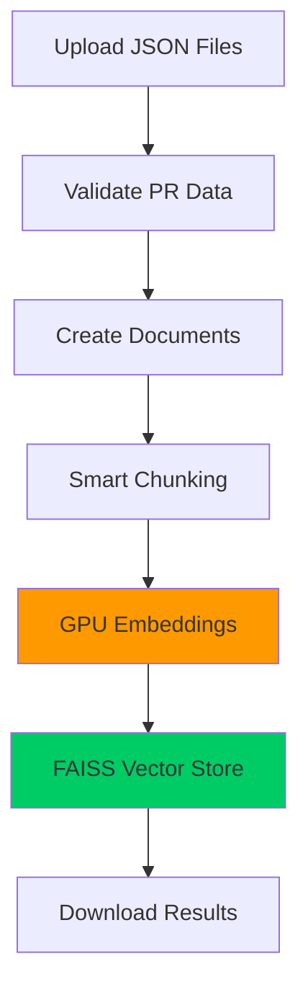

# 🚀 PRs4Dummies - Google Colab Indexing

This directory contains everything needed to run **high-performance PR indexing on Google Colab** with GPU acceleration.

## 🎯 **Why Use Colab?**

| Local Machine | Google Colab |
|---------------|--------------|
| 🐌 **CPU only**: 2-3 hours for 500 PRs | ⚡ **GPU**: 15-20 minutes for 500 PRs |
| 💾 **Memory limited** | 🚀 **12GB+ GPU memory** |
| 🔧 **Setup complexity** | ✅ **One-click setup** |

**Result**: **5-10x faster processing** with better embedding quality!

---

## 📦 **Quick Start (3 steps)**

### 1️⃣ **Setup Environment**
```python
# In a new Colab notebook cell:
!wget https://github.com/TheDiscoveryBoys/PRs4Dummies/raw/colab-attempt/colab/setup_colab.py
!python setup_colab.py
```

### 2️⃣ **Upload Your Data** 
```python
# Upload the indexer script and your data
!wget https://github.com/TheDiscoveryBoys/PRs4Dummies/raw/colab-attempt/colab/colab_indexer.py

# Run the indexer (will prompt for file uploads)
%run colab_indexer.py
```

### 3️⃣ **Download Results**
The script automatically creates and downloads a `vector_store.zip` file containing your embeddings.

---

## 📁 **Files in This Directory**

| File | Purpose |
|------|---------|
| `colab_indexer.py` | **Main indexing script** - GPU-optimized for Colab |
| `setup_colab.py` | **Environment setup** - Installs dependencies |
| `requirements-colab.txt` | **Dependencies list** - For manual installation |
| `README.md` | **This guide** - Complete instructions |

---

## 🔧 **Detailed Setup Instructions**

### **Option 1: Automated Setup (Recommended)**

1. **Create new Colab notebook**: [colab.research.google.com](https://colab.research.google.com)

2. **Enable GPU**: 
   - Go to `Runtime` → `Change runtime type`
   - Set `Hardware accelerator` → `GPU`
   - Click `Save`

3. **Run setup**:
   ```python
   # Download and run setup
   !wget https://github.com/TheDiscoveryBoys/PRs4Dummies/raw/colab-attempt/colab/setup_colab.py
   !python setup_colab.py
   ```

4. **Download indexer**:
   ```python
   !wget https://github.com/TheDiscoveryBoys/PRs4Dummies/raw/colab-attempt/colab/colab_indexer.py
   ```

5. **Run indexing**:
   ```python
   %run colab_indexer.py
   ```

### **Option 2: Manual Setup**

1. **Install dependencies**:
   ```python
   !pip install faiss-gpu langchain langchain-community
   !pip install sentence-transformers transformers einops tqdm
   ```

2. **Upload files manually**:
   - Upload `colab_indexer.py` 
   - Upload your JSON data files or ZIP archive

3. **Run indexer**:
   ```python
   from colab_indexer import ColabPRIndexer, ColabIndexingConfig
   
   # Configure for your dataset
   config = ColabIndexingConfig(
       embedding_model="nomic-ai/nomic-embed-text-v1.5",
       batch_size=64,  # Adjust based on GPU memory
       device="cuda"
   )
   
   # Run indexing
   indexer = ColabPRIndexer(config)
   vector_store = indexer.run_indexing()
   ```

---

## ⚙️ **Configuration Options**

### **Embedding Models (Choose One)**

| Model | Quality | Speed | Best For |
|-------|---------|-------|----------|
| `all-MiniLM-L6-v2` | Good | ⚡ Fast | Testing, <50 PRs |
| `all-mpnet-base-v2` | Better | 🔥 Medium | General use |
| `nomic-ai/nomic-embed-text-v1.5` | **Best** | 🚀 Medium | **Production, code-heavy PRs** |

### **Batch Sizes (GPU Memory)**

| GPU Type | Recommended Batch Size | Max Dataset |
|----------|----------------------|-------------|
| **Tesla T4** (Colab Free) | 32-64 | ~500 PRs |
| **Tesla P100** (Colab Pro) | 64-128 | ~1000 PRs |
| **Tesla V100** (Colab Pro+) | 128-256 | ~2000+ PRs |

### **Performance Tuning**

```python
# For small datasets (≤50 PRs) - prioritize speed
config = ColabIndexingConfig(
    embedding_model="all-MiniLM-L6-v2",
    batch_size=64,
    chunk_size=1000  # Smaller chunks
)

# For large datasets (500+ PRs) - prioritize quality  
config = ColabIndexingConfig(
    embedding_model="nomic-ai/nomic-embed-text-v1.5",
    batch_size=128,
    chunk_size=1500  # Preserve more context
)

# If running out of GPU memory
config = ColabIndexingConfig(
    embedding_model="nomic-ai/nomic-embed-text-v1.5", 
    batch_size=32,  # Reduce batch size
    device="cuda"
)
```

---

## 📊 **Expected Performance**

### **Processing Times**

| Dataset Size | GPU (Colab) | CPU (Local) | Speedup |
|--------------|-------------|-------------|---------|
| **10 PRs** | 30 seconds | 2 minutes | 4x |
| **50 PRs** | 2-3 minutes | 15 minutes | 5x |
| **100 PRs** | 5-7 minutes | 45 minutes | 7x |
| **500 PRs** | 15-20 minutes | 2-3 hours | **9x** |
| **1000 PRs** | 30-45 minutes | 4-6 hours | **8x** |

### **Quality Improvements**

Using `nomic-ai/nomic-embed-text-v1.5` vs basic models:
- ✅ **Better code understanding**: Trained on technical content
- ✅ **Longer context**: Handles 1500-char chunks without truncation  
- ✅ **More accurate retrieval**: Better semantic matching for PRs
- ✅ **GitHub-aware**: Understands PR structure and terminology

---

## 🔄 **Data Flow**



---

## 🧪 **Testing & Validation**

The indexer includes built-in validation:

```python
# Quick test after indexing
from langchain_community.vectorstores import FAISS
from langchain_community.embeddings import HuggingFaceEmbeddings

# Load and test
embeddings = HuggingFaceEmbeddings(
    model_name="nomic-ai/nomic-embed-text-v1.5",
    model_kwargs={'device': 'cuda', 'trust_remote_code': True}
)

vector_store = FAISS.load_local("vector_store", embeddings, allow_dangerous_deserialization=True)

# Test search
results = vector_store.similarity_search("authentication bug fix", k=3)
for i, result in enumerate(results):
    pr_num = result.metadata.get('pr_number')
    title = result.metadata.get('title', 'No title')
    print(f"{i+1}. PR #{pr_num}: {title}")
```

---

## 🚨 **Troubleshooting**

### **Common Issues**

| Problem | Solution |
|---------|----------|
| 🚫 "No GPU detected" | Enable GPU: Runtime → Change runtime type → GPU |
| 💥 "CUDA out of memory" | Reduce `batch_size` from 128 → 64 → 32 |
| 📦 "Module not found" | Restart runtime and re-run setup |
| 🐌 "Very slow processing" | Check GPU is enabled and being used |
| 📄 "No JSON files found" | Ensure files uploaded to `scraped_data/` directory |

### **Memory Optimization**

```python
# If running out of memory:
config = ColabIndexingConfig(
    batch_size=16,          # Reduce batch size
    chunk_size=1000,        # Smaller chunks
    device="cuda"
)

# For very large datasets:
config = ColabIndexingConfig(
    embedding_model="all-MiniLM-L6-v2",  # Smaller model
    batch_size=32,
    max_workers=2           # Reduce parallelism
)
```

### **Runtime Issues**

```python
# Clear GPU memory if needed
import torch
torch.cuda.empty_cache()

# Check GPU usage
!nvidia-smi
```

---

## 🎯 **Next Steps After Indexing**

1. **Download** the `vector_store.zip` file
2. **Extract** in your local `prs4dummies/indexing/` directory
3. **Update** your RAG system:
   ```python
   # Update your RAG core to use the new embeddings
   rag = RAGCore(
       vector_store_path="./vector_store", 
       embedding_model_name="nomic-ai/nomic-embed-text-v1.5"
   )
   ```
4. **Test** with specific questions about your PRs

---

## 🔗 **Links**

- [Google Colab](https://colab.research.google.com)
- [FAISS Documentation](https://faiss.ai/cpp_api/)
- [Sentence Transformers](https://www.sbert.net/)
- [Nomic Embed Models](https://huggingface.co/nomic-ai)

---

**Happy indexing!** 🚀✨
