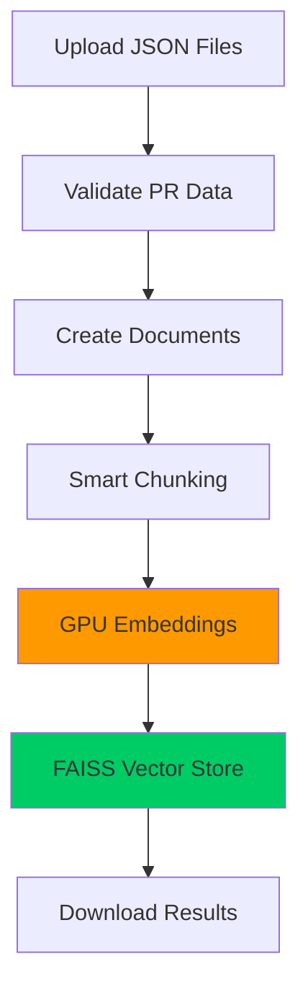

<div align="center">
  
       <h1>GitWit - By PRs4Dummies</h1>
  <em>By Shashin Gounden, Kyle Wilkins, and Gregory Maselle</em>
</div>
<br>

GitWit is a discord bot that exists to help people understand pull requests on specific github repos.

1. Ask for more context about the changes made on a PR.
2. Get information about a PR like who commented, what was commented, etc.
3. Get information about approvers, authors, and mergers of a PR if you ever want to follow up with more questions 😉.
4. Ask which PRs are related to a specific feature change. An example will be included at the end of the readme so keep reading 😼.

## HOW DO I RUN THIS THING?
---

## NB NB NB PLEASE READ
`Keep in mind that this is a process. There is a fair bit of set up involved due to the multiple steps involved and the usage of google colab due to hardware constraints.` **You will not need to run the scraper nor the indexer. The resultant files of the indexer can be downloaded by following the instructions within /indexing/vector_store/vector_store_files.txt**. 

---

# Enhanced Ansible GitHub Repository Scraper

A high-performance, multi-method GitHub repository scraper specifically designed for extracting pull request data from the Ansible repository. This enhanced version implements multiple efficient GitHub API approaches with improved error handling, rate limiting, and performance optimizations.

## 📋 Requirements
In /scraper run the following:
```bash
pip install -r requirements.txt
```

## 🔑 Authentication

### Option 1: Environment Variable (Recommended)
Create a `.env` file in your root project directory:
This github token must have repo access, enabling it to acces public repositories.
```bash
GITHUB_TOKEN=your_github_personal_access_token
```

### Option 2: Command Line Argument
```bash
python scraper_enhanced.py --token your_github_personal_access_token
```

### Option 3: System Environment Variable
```bash
export GITHUB_TOKEN=your_github_personal_access_token
```

## 🚀 Usage

Note that for our purposes we only included PRs that were merged.
Additionally, this may take a short while to start up.
### Basic Usage
```bash
# Scrape 50 merged PRs using the fastest method (direct API)
python scraper_enhanced.py --num-prs 50

# Scrape 100 PRs with custom output directory
python scraper_enhanced.py --num-prs 100 --output-dir my_data

```

### Advanced Usage
```bash
# Scrape all PRs (merged and unmerged) with batching support
python scraper_enhanced.py --num-prs 1000 --include-unmerged

# Here is a sample format of choosing a specific repo you want to scrape PRs from. Remember to include organisation/username before the repo name!!
python3 scraper_enhanced.py --repo=ShashinGoundenBBD/FUpBoard
```

## 📊 Command Line Options

| Option | Description | Default | Example |
|--------|-------------|---------|---------|
| `--token` | GitHub personal access token | From .env file | `--token abc123` |
| `--num-prs` | Number of PRs to scrape | 50 | `--num-prs 200` |
| `--output-dir` | Output directory for data | `scraped_data` | `--output-dir my_data` |
| `--repo-dir` | Repository clone directory | `ansible_repo_enhanced` | `--repo-dir ansible` |
| `--merged-only` | Only scrape merged PRs | True | `--merged-only` |
| `--include-unmerged` | Include unmerged/closed PRs | False | `--include-unmerged` |

## 📁 Output Structure

The scraper creates individual JSON files for each PR and a summary file:

```
scraped_data/
├── pr_12345.json          # Individual PR data
├── pr_12346.json          # Individual PR data
├── pr_12347.json          # Individual PR data
└── scrape_summary.json     # Summary of all scraped PRs
```

## 🔍 Troubleshooting

### Common Issues

1. **Rate Limit Exceeded**
   - Use a GitHub personal access token

2. **Timeout Errors**
   - Increase `--timeout` value
   - Check your internet connection

3. **Authentication Errors**
   - Verify your GitHub token has correct permissions
   - Check token expiration
   - Ensure token has `repo` scope for private repositories

## Converting The Scraped Data

Once you have scraped the data and /scraped_data contains the jsons for the PRs you want, run the following:

```bash
python convert_scraped_data.py
```

This will output the formatted scraped data in **/scraped_data_converted**. You will use this for the indexing in the next step.

Here are already scraped files for you to use. It correlates to roughly ~10000 PRs on the Ansible repo.
```bash
https://drive.google.com/file/d/1avXcmIlsOnveXfw0QzATwosMLhUNaqS2/view?usp=sharing
```
---

# Indexing With Google Colab

This step involving colab can be skipped as it may take quite long depending on the number of PRs that need to be indexed. You can find prepared index files here (HIGHLY recommended):

```bash
https://drive.google.com/drive/folders/1p50rDYsWNdiWqZ1sVtCdv_2KMmpvjz1T?usp=sharing
```

This should not take long to download, approximately 1-2 minutes.

## 🎯 **Why Use Colab?**

Simply put, we did not have the hardware we required for the indexer. We use an A100 GPU on google colab to perform the indexing. Note that this is paid. I will reiterate: This step will not be necessary because the repo will have instructions on how to download the prepared index files in /indexing/vector_store already for the indexing of ansible repo PRs. If you would like to do this on your own repo, you may need to pay for compute units on colab or use a smaller and less resource intensive embedding model that would work on a T4 GPU runtime.

## 📦 **How to set up**

### **Create new Colab notebook**: [colab.research.google.com](https://colab.research.google.com)

### **Enable GPU**: 
   - Go to `Runtime` → `Change runtime type`
   - Set `Hardware accelerator` → `GPU` (We use an A100 GPU)
   - Click `Save`

###  **Setup Environment**
```python
# In a new Colab notebook cell:
!wget https://raw.githubusercontent.com/TheDiscoveryBoys/PRs4Dummies/refs/heads/main/prs4dummies/colab/setup_colab.py 
```

Note that this will take several minutes, especially the installation of sentence-transformers.

### **Upload Your Data** 
Create a new folder within /content/ named **/scraped_data_converted**. You would then take the zipped scraped files and run the following to get the scraped data in your runtime. Ensure that your scraped data is in a path like so: ```content/scraped_data_converted/PRXXXXX.json```

```python
#Unzip the compressed scraped data jsons and put them in the /scraped_data_converted folder
!unzip /content/images.zip -d /content/scraped_data_converted/
```
```python
# Upload the setup and indexer scripts
!wget https://raw.githubusercontent.com/TheDiscoveryBoys/PRs4Dummies/refs/heads/main/prs4dummies/colab/colab_indexer.py
```
### **Run The Files**
Then you run the setup_colab script, followed by the colab_indexer. 

```python
!python setup_colab.py
!python colab_indexer.py
```
Depending on how many scraped files you have, this can take between 5 and 20 minutes.

### 3️⃣ **Download Results**

The script automatically creates a `vector_store` folder containing your embeddings. You will need to download this for the next step.

---

## ⚙️ **Configuration Options**

### **Embedding Models**

We use jinaai/jina-embeddings-v2-base-code as our embedder. It is relatively lightweight and is catered towards understanding and embedding code more effectively.

## 🔄 **Data Flow**



---

## 🚨 **Troubleshooting**

### **Common Issues**

| Problem | Solution |
|---------|----------|
| 🚫 "No GPU detected" | Enable GPU: Runtime → Change runtime type → GPU |
| 💥 "CUDA out of memory" | Reduce `batch_size` from 128 → 64 → 32 |
| 📦 "Module not found" | Restart runtime and re-run setup |
| 🐌 "Very slow processing" | Check GPU is enabled and being used |
| 📄 "No JSON files found" | Ensure files uploaded to `scraped_data_converted/` directory |

## 🎯 **Next Steps After Indexing**
0. **You can access the index files by following the instructions found within /indexing/vector_store/vector_store_files.txt or downloading them with the provided google drive link at the top of this section. Put those downloaded files in /indexing/vector_store**
1. **Download** the `vector_store` folder and its contents produced by your indexing on google colab.
2. **Extract** in your local `prs4dummies/indexing/` directory
3. **Continue** to the next step to run your bot and ask it questions!

For your convenience, we have provided the google drive link for the index folders here as well.
```bash
https://drive.google.com/drive/folders/1p50rDYsWNdiWqZ1sVtCdv_2KMmpvjz1T?usp=sharing
```
We highly recommend that you use these files.
These files are very large. They should not take too long to download ~1-2 minutes. If this is not viable, for testing purposes we recommend scraping approximately 50 PRs and using the resulting index files from that in the next step. The accuracy of the bot will vary and will be limited to those specific PRs though.

### 🔗 **Documentation Links**

- [Google Colab](https://colab.research.google.com)
- [FAISS Documentation](https://faiss.ai/cpp_api/)
- [Sentence Transformers](https://www.sbert.net/)

---

# Running the API and the Discord Bot

## Authentication Set Up

You will need to provide an OpenAI API key within your .env folder. There is a financial cost to this but the model we use is very simple. Up until now our testing has costed approximately $0.10 in *total*.
In your .env folder, add the following for OpenAI and Discord integration:

```bash
OPENAI_API_KEY="sk-your-key-..."
DISCORD_TOKEN="your-discord-token"
```

Please message Gregory Maselle, Kyle Wilkins, or Shashin Gounden for the discord token if you wish to run the bot on your local machine with minimal additional setup. This is highly advised.

**1.** Navigate to the /rag-core folder in the repo in your terminal.
```bash
cd rag-core/
```

**2.** In the terminal run 
```bash
python main.py
```
This will run the API the bot uses to answer questions.
You may have some missing dependencies, we ask that you pip install them.

**3.** Navigate to prs4dummies/discord-bot in another terminal and run the bot python script. You may need to pip install some dependencies.
```bash
cd prs4dummies/discord-bot
python bot.py
```
This will spin up the discord bot.

**4.** Finally, join our discord server and interact with the bot!
##### https://discord.gg/9BPum2Ut
Once you are on the server, go to general and ask the bot a question by @'ing the bot GitWit followed by your question.

Example:
```bash
@GitWit Tell me about the changes made on PR #85673? What goal is it trying to achieve?
```

Please consult the demo video for more examples of the bot working :).

And GitWit will use it's wit to check git and provide you with a response that's legit. Mostly legit. 
