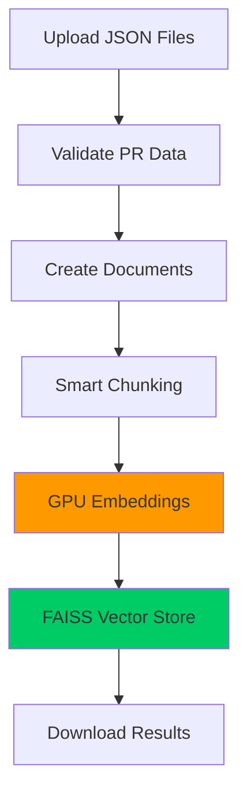

<div align="center">
  
  <h1>GitWit</h1>
  <em>By Shashin Gounden, Kyle Wilkins, and Gregory Maselle</em>
</div>
<br>
# HOW DO I RUN THIS THING?
---

## NB NB NB PLEASE READ
`Keep in mind that this is a process. There is a fair bit of set up involved due to the multiple steps involved and the usage of google colab due to hardware constraints.` **You will not need to run the scraper nor the indexer. The resultant files of the indexer can be downloaded by following the instructions within /indexing/vector_store/vector_store_files.txt**. 

---

# Enhanced Ansible GitHub Repository Scraper

A high-performance, multi-method GitHub repository scraper specifically designed for extracting pull request data from the Ansible repository. This enhanced version implements multiple efficient GitHub API approaches with improved error handling, rate limiting, and performance optimizations.

# 📒 Note on versions

You will see scraper\.py and scraper_enhanced.py. **Run scraper_enhanced.py**. scraper\.py is a legacy program that may have value for testing reasons and has been allowed to stay for that reason. **Use scraper_enhanced.py**.

## 🚀 Key Features

- **Multiple API Methods**: Choose from 4 different GitHub API approaches
- **Enhanced Performance**: Up to 10x faster than the original scraper
- **Robust Error Handling**: Automatic retries, rate limiting, and graceful degradation
- **Streaming Processing**: Memory-efficient processing of large numbers of PRs
- **Comprehensive Data Extraction**: Full PR content including comments, reviews, and diffs
- **Configurable Settings**: Customizable timeouts, retries, and batch sizes

## 🔧 API Methods

### 1. **Direct Repository API** (Recommended - Fastest)
- **Method**: `--api-method direct`
- **Benefits**: 
  - Direct access to repository data
  - Higher rate limits (5000 requests/hour with token)
  - More reliable than search API
  - Can fetch unlimited PRs with pagination
- **Best for**: High-volume scraping with authentication
### 2. **REST API with Pagination** (Good Performance)
- **Method**: `--api-method rest`
- **Benefits**:
  - Better control over pagination
  - Can handle very large numbers of PRs
  - Returns raw JSON data (faster processing)
- **Best for**: Large-scale scraping with custom pagination control

### 3. **GraphQL API** (Most Efficient)
- **Method**: `--api-method graphql`
- **Benefits**:
  - Single request can fetch multiple pages
  - Gets only the data you need
  - Most efficient for large datasets
  - Can fetch 100 PRs per request
- **Best for**: Maximum efficiency with authentication token
- **Requires**: GitHub personal access token

### 4. **Search API** (Legacy - Slower)
- **Method**: `--api-method search`
- **Benefits**: Original method for comparison
- **Limitations**: Hard limit of 1000 results, slower performance
- **Best for**: Backward compatibility

## 📋 Requirements

```bash
pip install -r requirements-improved.txt
```

**Note**: The `requirements-improved.txt` file contains all necessary dependencies including:
- PyGithub
- gitpython  
- requests
- python-dotenv
- Additional enhanced features and optimizations

## 🔑 Authentication

### Option 1: Environment Variable (Recommended)
Create a `.env` file in your project directory:
```bash
GITHUB_TOKEN=your_github_personal_access_token
```

### Option 2: Command Line Argument
```bash
python scraper_enhanced.py --token your_github_personal_access_token
```

### Option 3: System Environment Variable
```bash
export GITHUB_TOKEN=your_github_personal_access_token
```

## 🚀 Usage

Note that for our purposes we only included PRs that were merged.
### Basic Usage
```bash
# Scrape 50 merged PRs using the fastest method (direct API)
python scraper_enhanced.py --num-prs 50

# Scrape 100 PRs with custom output directory
python scraper_enhanced.py --num-prs 100 --output-dir my_data

# Use GraphQL API for maximum efficiency
python scraper_enhanced.py --num-prs 200 --api-method graphql

```

### Advanced Usage
```bash
# Scrape all PRs (merged and unmerged) with batching support
python scraper_enhanced.py --num-prs 1000 --include-unmerged

# Customize performance settings
python scraper_enhanced.py --num-prs 500 \
    --max-workers 5 \
    --batch-size 25 \
    --timeout 30 \
    --max-retries 5

# Use REST API with custom settings
python scraper_enhanced.py --num-prs 300 \
    --api-method rest \
    --output-dir rest_api_data

# Here is a sample format of choosing a specific repo you want to scrape PRs from. Remember to include organisation/username before the repo name!!
python3 scraper_enhanced.py --repo=ShashinGoundenBBD/FUpBoard
```

## 📊 Command Line Options

| Option | Description | Default | Example |
|--------|-------------|---------|---------|
| `--token` | GitHub personal access token | From .env file | `--token abc123` |
| `--num-prs` | Number of PRs to scrape | 50 | `--num-prs 200` |
| `--output-dir` | Output directory for data | `scraped_data` | `--output-dir my_data` |
| `--repo-dir` | Repository clone directory | `ansible_repo_enhanced` | `--repo-dir ansible` |
| `--merged-only` | Only scrape merged PRs | True | `--merged-only` |
| `--include-unmerged` | Include unmerged/closed PRs | False | `--include-unmerged` |
| `--max-workers` | Maximum parallel workers | 3 | `--max-workers 5` |
| `--batch-size` | PRs per batch | 10 | `--batch-size 25` |
| `--timeout` | API request timeout (seconds) | 15 | `--timeout 30` |
| `--max-retries` | Maximum retry attempts | 3 | `--max-retries 5` |
| `--api-method` | API method to use | `direct` | `--api-method graphql` |

## 📁 Output Structure

The scraper creates individual JSON files for each PR and a summary file:

```
scraped_data/
├── pr_12345.json          # Individual PR data
├── pr_12346.json          # Individual PR data
├── pr_12347.json          # Individual PR data
└── scrape_summary.json     # Summary of all scraped PRs
```

## ⚡ Performance Comparison

| API Method | Speed | Rate Limit | Best For |
|------------|-------|------------|----------|
| **Direct** | ⭐⭐⭐⭐⭐ | 5000/hr | High-volume scraping |
| **REST** | ⭐⭐⭐⭐ | 5000/hr | Custom pagination |
| **GraphQL** | ⭐⭐⭐⭐⭐ | 5000/hr | Maximum efficiency |
| **Search** | ⭐⭐ | 1000/hr | Legacy compatibility |

## 🛡️ Error Handling & Reliability

- **Automatic Retries**: Configurable retry logic with exponential backoff
- **Rate Limiting**: Intelligent rate limiting with automatic backoff
- **Graceful Degradation**: Falls back to alternative methods on failure
- **Signal Handling**: Graceful shutdown on Ctrl+C
- **Progress Tracking**: Real-time progress updates and ETA calculations

## 🔍 Troubleshooting

### Common Issues

1. **Rate Limit Exceeded**
   - Use a GitHub personal access token
   - Reduce `--max-workers` and `--batch-size`
   - The scraper automatically handles rate limiting

2. **Timeout Errors**
   - Increase `--timeout` value
   - Check your internet connection
   - Reduce `--batch-size` for slower connections

3. **Authentication Errors**
   - Verify your GitHub token has correct permissions
   - Check token expiration
   - Ensure token has `repo` scope for private repositories

### Performance Tips

- Use `--api-method direct` for best performance
- Set `--max-workers` to 3-5 for optimal balance
- Use `--batch-size` of 10-25 for memory efficiency
- Enable `--merged-only` to focus on relevant PRs

## 📈 Scaling Considerations

- **Small Scale** (< 100 PRs): Use default settings
- **Medium Scale** (100-500 PRs): Increase `--max-workers` to 5
- **Large Scale** (500+ PRs): Use `--api-method graphql` with `--batch-size 25`
- **Very Large Scale** (1000+ PRs): Consider running multiple instances with different date ranges

---

# Indexing With Google Colab

This directory contains everything needed to run **high-performance PR indexing on Google Colab** with GPU acceleration.

## 🎯 **Why Use Colab?**

Simply put, we did not have the hardware we required for the indexer. We use an A100 GPU on google colab to perform the indexing. Note that this is paid. I will reiterate: This step will not be necessary because the repo will have the index files in /indexing/vector_store already for the indexing of ansible repo PRs. If you would like to do this on your own repo, you may need to pay for compute units on colab or use a smaller and less resource intensive embedding model.

## 📦 **How to set up**

### **Create new Colab notebook**: [colab.research.google.com](https://colab.research.google.com)

### **Enable GPU**: 
   - Go to `Runtime` → `Change runtime type`
   - Set `Hardware accelerator` → `GPU` (We use an A100 GPU)
   - Click `Save`

###  **Setup Environment**
```python
# In a new Colab notebook cell:
!wget https://github.com/TheDiscoveryBoys/PRs4Dummies/raw/colab-attempt/colab/setup_colab.py
!python setup_colab.py
```

### **Upload Your Data** 
Create a new folder within /content/ named **/scraped_data_converted**. You would then take the zipped scraped files and run the following to get the scraped data in your runtime. Ensure that your scraped data is in a path like so: ```content/scraped_data_converted/PRXXXXX.json```

```python
#Unzip the compressed scraped data jsons and put them in the /scraped_data_converted folder
!unzip /content/images.zip -d /content/scraped_data_converted/
```
```python
# Upload the setup and indexer scripts
!wget https://github.com/TheDiscoveryBoys/PRs4Dummies/raw/colab-attempt/colab/colab_indexer.py
!wget https://github.com/TheDiscoveryBoys/PRs4Dummies/raw/colab-attempt/colab/setup_colab.py
```
### **Run The Files**
Then you run the setup_colab script, followed by the colab_indexer. 

```python
!python setup_colab.py
!python colab_indexer.py
```
Depending on how many scraped files you have, this can take between 5 and 20 minutes.

### 3️⃣ **Download Results**
The script automatically creates and downloads a `vector_store.zip` file containing your embeddings.

---

## ⚙️ **Configuration Options**

### **Embedding Models **

We use jinaai/jina-embeddings-v2-base-code as our embedder. It is relatively lightweight and is catered towards understanding and embedding code more effectively.

### **Batch Sizes (GPU Memory)**

 Recommended Batch Size | Max Dataset |
----------------------|-------------|
 32-64 | ~500 PRs |
 64-128 | ~1000 PRs |
 128-256 | ~2000+ PRs |

---

## 🔄 **Data Flow**



---

## 🚨 **Troubleshooting**

### **Common Issues**

| Problem | Solution |
|---------|----------|
| 🚫 "No GPU detected" | Enable GPU: Runtime → Change runtime type → GPU |
| 💥 "CUDA out of memory" | Reduce `batch_size` from 128 → 64 → 32 |
| 📦 "Module not found" | Restart runtime and re-run setup |
| 🐌 "Very slow processing" | Check GPU is enabled and being used |
| 📄 "No JSON files found" | Ensure files uploaded to `scraped_data_converted/` directory |

### **Memory Optimization**

```python
# If running out of memory:
config = ColabIndexingConfig(
    batch_size=16,          # Reduce batch size
    chunk_size=1000,        # Smaller chunks
    device="cuda"
)

# For very large datasets:
config = ColabIndexingConfig(
    embedding_model="all-MiniLM-L6-v2",  # Smaller model
    batch_size=32,
    max_workers=2           # Reduce parallelism
)
```

## 🎯 **Next Steps After Indexing**
0. **You can access the index files by following the instructions found within /indexing/vector_store/vector_store_files.txt. Put those downloaded files in /indexing/vector_store
1. **Download** the `vector_store.zip` file
2. **Extract** in your local `prs4dummies/indexing/` directory
3. **Continue** to the next step to run your bot and ask it questions!


## 🔗 **Links**

- [Google Colab](https://colab.research.google.com)
- [FAISS Documentation](https://faiss.ai/cpp_api/)
- [Sentence Transformers](https://www.sbert.net/)

---

# Running the API and the Discord Bot

## Authentication Set Up

You will need to provide an OpenAI API key within your .env folder. There is a financial cost to this but the model we use is very simple. Up until now our testing has costed approximately $0.10 in *total*.
In your .env folder, add the following for OpenAI and Discord integration:

```bash
OPENAI_API_KEY="sk-your-key-..."
DISCORD_TOKEN="your-discord-token"
```

Please message Gregory Maselle, Kyle Wilkins, or Shashin Gounden for the discord token if you wish to run the bot on your side.

**1.** Navigate to the /rag-core folder in the repo.

**2.** In the terminal run 
```bash
python main.py
```
You may have some missing dependencies, we ask that you pip install them.

**3.** In the terminal run 
```bash
python bot.py
```
This will spin up the discord bot.

**4.** Finally, join our discord server and interact with the bot!
##### https://discord.gg/9BPum2Ut
Once you are on the server, go to general and ask the bot a question by @'ing the bot GitWit followed by your question.

Example:
```bash
@GitWit Who commented on PR #85673?
```

Please consult the demo video for more examples of the bot working :).

And GitWit will use it's wit to check git and provide you with a response that's legit. Mostly legit. 
